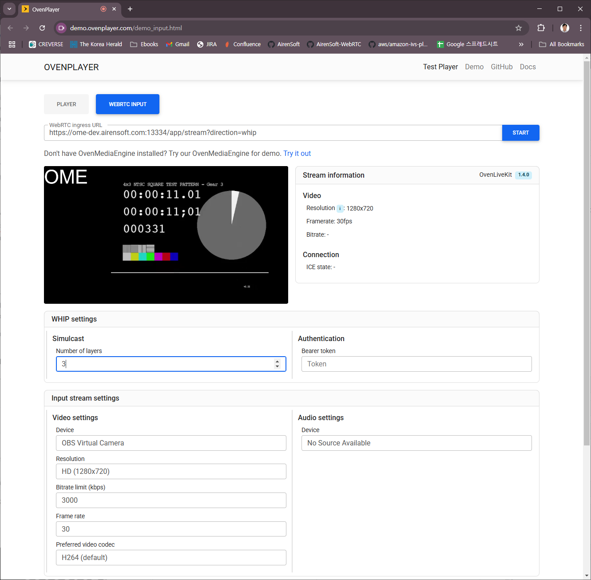
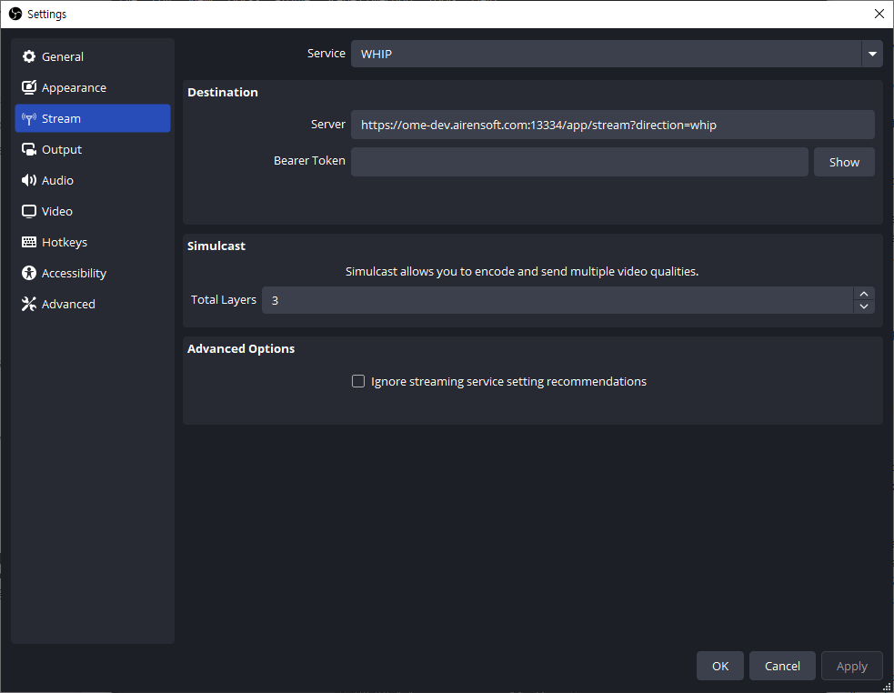
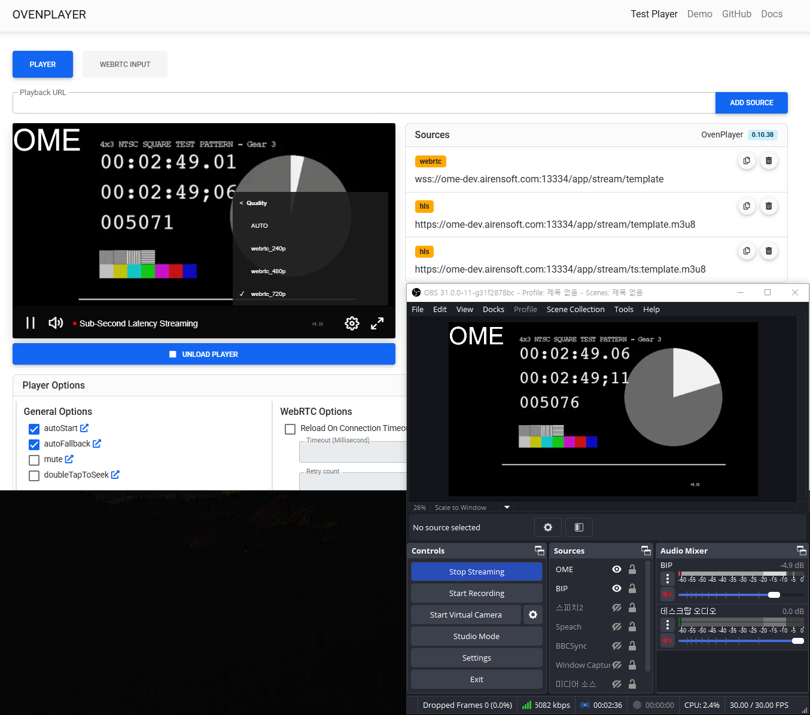
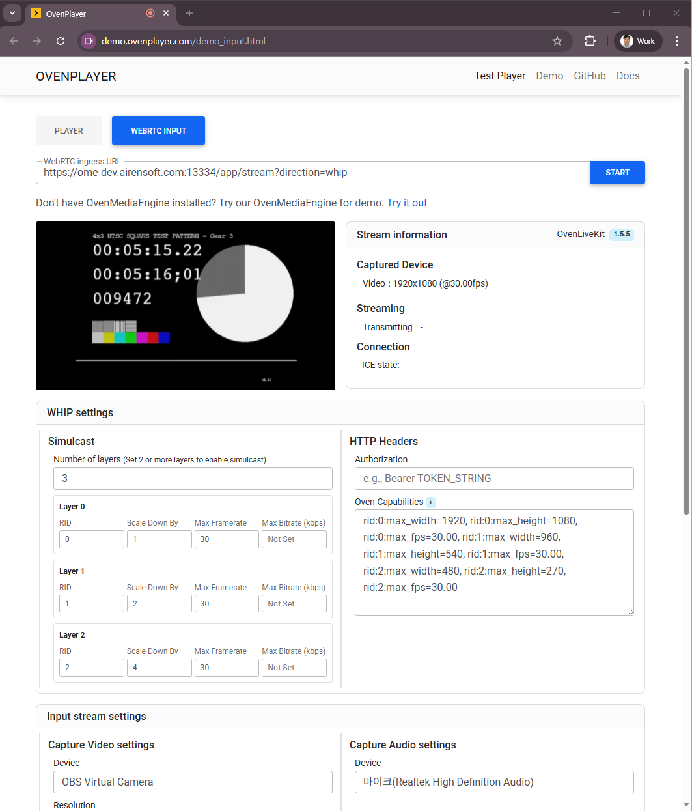
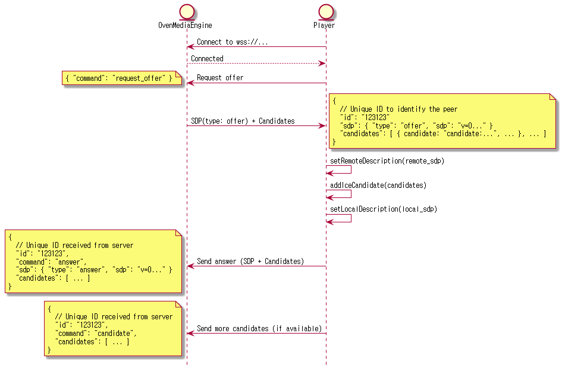

OvenMediaEngine supports WebRTC ingest from web browsers and any encoder that implements WebRTC. Both the self-defined signaling protocol and [WHIP](https://datatracker.ietf.org/doc/draft-ietf-wish-whip/) are supported.

| | |
|---|---|
| **Container** | RTP / RTCP |
| **Security** | DTLS, SRTP |
| **Transport** | ICE |
| **Error Correction** | ULPFEC (VP8, H.264), In-band FEC (Opus) |
| **Codec** | VP8, H.264, H.265, Opus |
| **Signaling** | Self-Defined Protocol (WebSocket), WHIP (HTTP) |
| **Additional Features** | Simulcast |

## Configuration

### Bind

```xml
<!-- /Server/Bind/Providers/WebRTC -->
<WebRTC>
    <Signalling>
        <Port>3333</Port>
        <TLSPort>3334</TLSPort>
    </Signalling>
    <IceCandidates>
        <IceCandidate>${PublicIP}:10000/udp</IceCandidate>
        <IceCandidate>${PublicIP}:3479/tcp</IceCandidate>  <!-- Direct TCP ICE (RFC 6544) -->
        <TcpRelay>${PublicIP}:3478</TcpRelay>              <!-- TURN relay -->
        <TcpRelayForce>false</TcpRelayForce>
        <IceWorkerCount>4</IceWorkerCount>
        <TcpIceWorkerCount>1</TcpIceWorkerCount>
        <TcpRelayWorkerCount>1</TcpRelayWorkerCount>
        <DefaultTransport>udptcp</DefaultTransport>
    </IceCandidates>
</WebRTC>
```

`<Signalling>/<Port>` sets the unsecured WebSocket port. `<TLSPort>` sets the TLS-encrypted port.

#### ICE Candidates

OvenMediaEngine supports three transport types for WebRTC ingest:

| Type | Configuration | Description |
|---|---|---|
| **UDP** | `<IceCandidate>IP:port/udp</IceCandidate>` | Standard UDP, lowest latency, preferred by browsers |
| **Direct TCP ICE** | `<IceCandidate>IP:port/tcp</IceCandidate>` | Direct TCP connection to OME (RFC 6544, passive mode) |
| **TURN relay** | `<TcpRelay>IP:port</TcpRelay>` | OME's embedded TURN server, works through strict firewalls |

Use `${PublicIP}` to have OME auto-resolve the public IP via `<StunServer>` at startup. For more information on `<TcpRelay>` URL format, see [WebRTC over TCP](webrtc.md#webrtc-over-tcp).


:::danger

**Do not use `*` for ICE candidate IP in production.**

`*` causes OME to advertise every network interface (including Docker bridge interfaces `172.17.x.x`, VPN adapters, and internal NICs) as ICE candidates. Encoders will attempt connectivity checks against all of them, which significantly increases ICE negotiation time and can cause connection delays or failures.

Always specify the exact IP the encoder can reach:
- Specific IP: `<IceCandidate>203.0.113.1:10000/udp</IceCandidate>`
- Auto-detected via STUN: `<IceCandidate>${PublicIP}:10000/udp</IceCandidate>` (requires `<StunServer>` in `Server.xml`)

:::


#### Worker Threads

Each transport type has an independent worker-thread pool:

| Configuration | Default | Applies to |
|---|---|---|
| `<IceWorkerCount>` | 1 | UDP ICE candidate sockets |
| `<TcpIceWorkerCount>` | 1 | Direct TCP ICE candidate sockets (RFC 6544) |
| `<TcpRelayWorkerCount>` | 1 | TURN relay sockets |

The worker count applies **per port**. Increase `<IceWorkerCount>` or `<TcpIceWorkerCount>` when handling a large number of simultaneous publishers on a multi-core server.

> **Prefer a single port with a higher worker count over multiple ports.** Adding ports multiplies both the thread count and the number of ICE candidates advertised to clients, and more candidates mean slower ICE negotiation. For throughput scaling, raise the worker count on a single port instead.

#### Default Transport

`<DefaultTransport>` controls which candidate types are included in the signaling response when the client does not specify a `?transport` query parameter. Valid values: `udp`, `tcp`, `relay`, `udptcp` (default), `all`. See [?transport Parameter](webrtc.md#transport-parameter) for the full mapping.

### Application

```xml
<!-- /Server/VirtualHosts/VirtualHost/Applications/Application/Providers/WebRTC -->
<WebRTC>
    <Timeout>30000</Timeout>
    <FIRInterval>3000</FIRInterval>
    <RtcpBasedTimestamp>false</RtcpBasedTimestamp>
    <CrossDomains>
        <Url>*</Url>
    </CrossDomains>
</WebRTC>
```

| Parameter | Description |
|---|---|
| `Timeout` | Maximum duration (ms) to wait for an ICE Binding request/response before terminating the session. |
| `FIRInterval` | Interval (ms) for sending a Full Intra Request (FIR) to force IDR frame generation. Set to `0` to disable. |
| `RtcpBasedTimestamp` | `false` (default): each track's RTP timestamp starts from zero independently, no waiting for RTCP SR. `true`: RTCP Sender Reports synchronize A/V timestamps on a common clock. Use `true` only when the sender reliably sends RTCP SR; otherwise stream start may be delayed up to 5 seconds. |
| `CrossDomains` | Allowed domains for signaling requests (CORS). |

## URL Patterns

### Self-defined Signaling

WebSocket-based. Add `?direction=send` to distinguish ingest from playback.

> `ws[s]://<Host>[:<Port>]/<App>/<Stream>?direction=send`

### WHIP

HTTP-based. Add `?direction=whip`.

> `http[s]://<Host>[:<Port>]/<App>/<Stream>?direction=whip`

### WebRTC over TCP

OvenMediaEngine supports two independent mechanisms for WebRTC/TCP ingest:

| Mode | How it works | Configuration |
|---|---|---|
| **Direct TCP ICE** (RFC 6544) | Encoder connects directly to OME over TCP, no relay | `<IceCandidate>IP:port/tcp</IceCandidate>` |
| **TURN relay** (RFC 8656) | Encoder connects to OME's embedded TURN server over TCP, works through strict firewalls | `<TcpRelay>IP:port</TcpRelay>` |

Both modes can be active simultaneously. Use the `?transport` parameter to control which candidates are included in the signaling response.

#### `?transport` Parameter

| Value | UDP candidates | Direct TCP candidates | TURN relay (`iceServers`) |
|---|---|---|---|
| (none) | follows `<DefaultTransport>` (default: `udptcp`) | follows `<DefaultTransport>` | follows `<TcpRelayForce>` (default: `false`) |
| `udp` | ✓ | — | — |
| `tcp` | — | ✓ | — |
| `relay` | — | — | ✓ |
| `udptcp` | ✓ | ✓ | — |
| `all` | ✓ | ✓ | ✓ |

`<DefaultTransport>` sets the policy when `?transport` is absent. Valid values: `udptcp` (default), `udp`, `tcp`, `relay`, `all`.

**Example URLs:**

> `ws[s]://<Host>[:<Port>]/<App>/<Stream>?direction=send&transport=tcp`
>
> `http[s]://<Host>[:<Port>]/<App>/<Stream>?direction=whip&transport=all`


:::warning

**Behavior change from previous versions**

`?transport=tcp` previously routed traffic through the embedded TURN server. It now means **Direct TCP ICE** (RFC 6544), a direct TCP connection to OME without any relay.

- Previous `tcp` behavior → use `?transport=relay` instead
- `<TcpRelay>` must be configured in `<Bind>` for `relay` to work
- `<TcpForce>` has been renamed to `<TcpRelayForce>`. The old name is still accepted. When `true`, TURN relay info is always included in the response regardless of `?transport`.

:::


## Simulcast

Simulcast allows encoders to send multiple quality layers simultaneously without server-side transcoding, reducing costs on multi-core servers.

Simulcast is supported via **WHIP signaling only**. Test using OvenLiveKit or OBS.







### Playlist Template for Simulcast

When a simulcast encoder sends N video tracks, OME creates N tracks sharing the same Variant Name. For example, with the profile below and 3 simulcast layers, OME creates 3 tracks all named `video_bypass`:

```xml
<!-- /Server/VirtualHosts/VirtualHost/Applications/Application -->
<OutputProfiles>
    <OutputProfile>
        <Name>stream</Name>
        <OutputStreamName>${OriginStreamName}</OutputStreamName>
        <Encodes>
            <Video>
                <Name>video_bypass</Name>
                <Bypass>true</Bypass>
            </Video>
        </Encodes>
    </OutputProfile>
</OutputProfiles>
```

Reference each layer by index using `<VideoIndexHint>` / `<AudioIndexHint>`:


```xml
<!-- /Server/VirtualHosts/VirtualHost/Applications/Application/OutputProfiles -->
<strong><OutputProfile>
</strong><strong>    ...
</strong>    <Playlist>
        <Name>simulcast</Name>
        <FileName>template</FileName>
        <Options>
            <WebRtcAutoAbr>true</WebRtcAutoAbr>
            <HLSChunklistPathDepth>0</HLSChunklistPathDepth>
            <EnableTsPackaging>true</EnableTsPackaging>
        </Options>
        <Rendition>
            <Name>first</Name>
            <Video>video_bypass</Video>
            <VideoIndexHint>0</VideoIndexHint> <!-- Optional, default : 0 -->
            <Audio>aac_audio</Audio>
        </Rendition>
        <Rendition>
            <Name>second</Name>
            <Video>video_bypass</Video>
            <VideoIndexHint>1</VideoIndexHint> <!-- Optional, default : 0 -->
            <Audio>aac_audio</Audio>
            <AudioIndexHint>0</AudioIndexHint> <!-- Optional, default : 0 -->
        </Rendition>
    </Playlist>
    ...
</OutputProfile>
```


### RenditionTemplate

Manually defining a Rendition per simulcast layer requires a config change and server restart whenever the encoder adds a layer. `<RenditionTemplate>` auto-generates Renditions based on conditions, eliminating this need:

```xml
<!-- /Server/VirtualHosts/VirtualHost/Applications/Application/OutputProfiles -->
<OutputProfile>
    ...
    <Playlist>
        <Name>template</Name>
        <FileName>template</FileName>
        <Options>
            <WebRtcAutoAbr>true</WebRtcAutoAbr>
            <HLSChunklistPathDepth>0</HLSChunklistPathDepth>
            <EnableTsPackaging>true</EnableTsPackaging>
        </Options>
        <RenditionTemplate>
            <Name>hls_${Height}p</Name>
            <VideoTemplate>
                <EncodingType>bypassed</EncodingType>
            </VideoTemplate>
            <AudioTemplate>
                <VariantName>aac_audio</VariantName>
            </AudioTemplate>
        </RenditionTemplate>
    </Playlist>
    ...
</OutputProfile>
```

Available name macros: `${Width}` | `${Height}` | `${Bitrate}` | `${Framerate}` | `${Samplerate}` | `${Channel}`

Add conditions to filter which tracks are included:

```xml
<!-- /Server/VirtualHosts/VirtualHost/Applications/Application/OutputProfiles/OutputProfile/Playlist -->
<RenditionTemplate>
    <VideoTemplate>
        <EncodingType>bypassed</EncodingType> <!-- all | bypassed | encoded -->
        <VariantName>bypass_video</VariantName>
        <VideoIndexHint>0</VideoIndexHint>
        <MaxWidth>1080</MaxWidth>
        <MinWidth>240</MinWidth>
        <MaxHeight>720</MaxHeight>
        <MinHeight>240</MinHeight>
        <MaxFPS>30</MaxFPS>
        <MinFPS>30</MinFPS>
        <MaxBitrate>2000000</MaxBitrate>
        <MinBitrate>500000</MinBitrate>
    </VideoTemplate>
    <AudioTemplate>
        <EncodingType>encoded</EncodingType> <!-- all | bypassed | encoded -->
        <VariantName>aac_audio</VariantName>
        <MaxBitrate>128000</MaxBitrate>
        <MinBitrate>128000</MinBitrate>
        <MaxSamplerate>48000</MaxSamplerate>
        <MinSamplerate>48000</MinSamplerate>
        <MaxChannel>2</MaxChannel>
        <MinChannel>2</MinChannel>
        <AudioIndexHint>0</AudioIndexHint>
    </AudioTemplate>
    ...
</RenditionTemplate>
```

## WebRTC Producer

A demo page is available for testing WebRTC ingest:

[https://demo.ovenplayer.com/demo_input.html](https://demo.ovenplayer.com/demo_input.html)




:::warning

`getUserMedia` only works in a [secure context](https://developer.mozilla.org/en-US/docs/Web/API/MediaDevices/getUserMedia#privacy_and_security). The demo at [https://demo.ovenplayer.com/demo_input.html](https://demo.ovenplayer.com/demo_input.html) requires OME to serve signaling over `wss`. If you cannot install a TLS certificate, temporarily allow insecure content for `demo.ovenplayer.com` in your browser settings.

:::


### Self-defined Signaling Protocol

To build a custom WebRTC producer, implement OvenMediaEngine's Self-defined Signaling Protocol or WHIP. The self-defined protocol uses the [same format as WebRTC Streaming](../streaming/webrtc-publishing.md#signalling-protocol).



Connect to `ws[s]://host:port/app/stream?direction=send` via WebSocket and send a request-offer command. OME responds with an offer SDP containing all configured ICE candidates (UDP, Direct TCP if configured) and, if `<TcpRelay>` is set, an `iceServers` field with TURN server information. Pass `iceServers` to `RTCPeerConnection`, then call `setRemoteDescription`, `addIceCandidate` with the offer SDP, generate an answer SDP, and send it back to OME.
