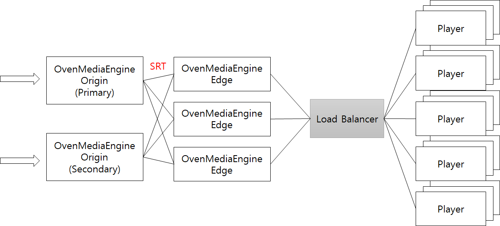
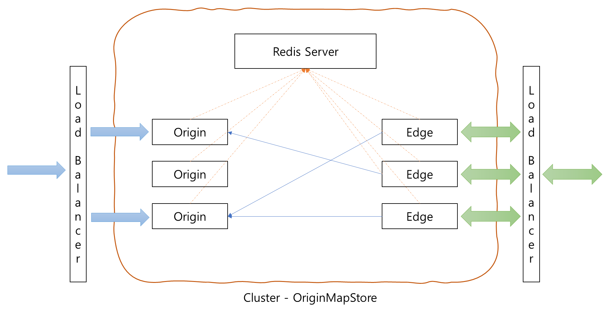

OvenMediaEngine supports clustering and ensures High Availability (HA) and scalability. For this we provide the `OriginMap` and `OriginMapStore` features. [OriginMap ](origin-edge-clustering.md#originmap)is a method of configuring Origin server information in each Edge server, and [OriginMapStore ](origin-edge-clustering.md#originmapstore)is a method for Origin servers and Edge servers to dynamically share information through Redis Server.

## OriginMap



The OvenMediaEngine running as edge pulls a stream from an external server when a user requests it. The external server could be another OvenMediaEngine with OVT enabled or another stream server that supports RTSP.&#x20;

The OVT is a protocol defined by OvenMediaEngine to relay stream between Origin-Edge and OVT can be run over SRT and TCP. For more information on the SRT Protocol, please visit the [SRT Alliance](https://www.srtalliance.org/) site.

### Origin&#x20;

OvenMediaEngine provides OVT protocol for passing streams from the origin to the edge. To run OvenMediaEngine as Origin, OVT port, and OVT Publisher must be enabled as follows :

```xml
<Server version="5">
	<Bind>
		<Publishers>
			<OVT>
				<Port>9000</Port>
			</OVT>
		</Publishers>
	</Bind>
	<VirtualHosts>
    		<VirtualHost>
		    	<Applications>
				<Application>
					...
					<Publishers>
						<OVT />
					</Publishers>
				</Application>		
			</Applications>
		</VirtualHost>
	</VirtualHosts>
</Server>
```

### Edge

The role of the edge is to receive and distribute streams from an origin. You can configure hundreds of Edge to distribute traffic to your players. As a result of testing, a single edge can stream 4-5Gbps traffic by WebRTC based on AWS C5.2XLarge. If you need to stream to thousands of people, you can configure and use multiple edges.

The edge supports OVT and RTSP to pull stream from an origin. In the near future, we will support more protocols. The stream pulled through OVT is bypassed without being encoded.&#x20;

To run OvenMediaEngine as Edge, you need to add Origins elements to the configuration file as follows:

```markup
<VirtualHosts>
    <VirtualHost>
        <Origins>
            <Properties>
                <NoInputFailoverTimeout>3000</NoInputFailoverTimeout>
                <UnusedStreamDeletionTimeout>60000</UnusedStreamDeletionTimeout>
            </Properties>
            <Origin>
                <Location>/app/stream</Location>
                <Pass>
                    <Scheme>ovt</Scheme>
                    <Urls><Url>origin.com:9000/app/stream_720p</Url></Urls>
                    <ForwardQueryParams>true</ForwardQueryParams>
                </Pass>
            </Origin>
            <Origin>
                <Location>/app/</Location>
                <Pass>
                    <Scheme>OVT</Scheme>
                    <Urls><Url>origin.com:9000/app/</Url></Urls>
                </Pass>
            </Origin>
            <Origin>
                <Location>/</Location>
                <Pass>
                    <Scheme>RTSP</Scheme>
                    <Urls><Url>origin2.com:9000/</Url></Urls>
                </Pass>
            </Origin>
        </Origins>
    </VirtualHost>
</VirtualHosts>
```

The `<Origin>`is a rule about where to pull a stream from for what request.&#x20;

The `<Origin>`has the ability to automatically create an application with that name if the application you set in `<Location>` doesn't exist on the server.  If an application exists in the system, a stream will be created in the application.

#### \<Properties>

**NoInputFailoverTimeout****&#x20;(default 3000)**

NoInputFailoverTimeout is the time (in milliseconds) to switch to the next URL if there is no input for the set time.

**UnusedStreamDeletionTimeout****&#x20;(default 60000)**

UnusedStreamDeletionTimeout is a function that deletes a stream created with OriginMap if there is no viewer for a set amount of time (milliseconds). This helps to save network traffic and system resources for Origin and Edge.

#### \<Origin>

For a detailed description of Origin's elements, see:

**Location**

Origin is already filtered by domain because it belongs to VirtualHost. Therefore, in Location, set App, Stream, and File to match except domain area. If a request matches multiple Origins, the top of them runs.

**Pass**

Pass consists of Scheme and Url.&#x20;

`<Scheme>` is the protocol that will use to pull from the Origin Stream. It currently can be configured as `OVT`or `RTSP`.&#x20;

If the origin server is OvenMediaEngine, you have to set `OVT`into the `<Scheme>`.&#x20;

You can pull the stream from the RTSP server by setting `RTSP`into the`<Scheme>`. In this case, the `<RTSPPull>` provider must be enabled. The application automatically generated by Origin doesn't need to worry because all providers are enabled.

`Urls` is the address of origin stream and can consist of multiple URLs.

`ForwardQueryParams` is an option to determine whether to pass the query string part to the server at the URL you requested to play.(**Default : true**) Some RTSP servers classify streams according to query strings, so you may want this option to be set to false. For example, if a user requests `ws://host:port/app/stream?transport=tcp` to play WebRTC, the `?transport=tcp` may also be forwarded to the RTSP server, so the stream may not be found on the RTSP server. On the other hand, OVT does not affect anything, so you can use it as the default setting.

### Rules for generating Origin URL

The final address to be requested by OvenMediaEngine is generated by combining the configured Url and user's request except for Location. For example, if the following is set

```markup
<Location>/edge_app/</Location>
<Pass>
    <Scheme>ovt</Scheme>
    <Urls><Url>origin.com:9000/origin_app/</Url></Urls>
</Pass>
```

If a user requests `http://edge.com/edge_app/stream`, OvenMediaEngine makes an address to `ovt: //origin.com: 9000/origin_app/stream`.

### TrackSet (selective track delivery over OVT)

A `TrackSet` is a named subset of an `OutputProfile`'s tracks. It is exposed over the OVT publisher so that an Edge can pull only a portion of the stream, instead of every track produced by the Origin's `OutputProfile`. This is useful when an Edge only needs a single rendition, a single audio language, or any other slice of the available tracks, and you want to avoid sending unused tracks across the network.

Each `TrackSet` is declared inside an `<OutputProfile>` in `Server.xml`. The set has a `<Name>` and any number of `<Video>` and `<Audio>` entries. Each entry references an encode name from the same `<OutputProfile>` and may optionally specify an `<IndexHint>` to disambiguate when a single encode produces multiple output tracks (for example, a multilingual audio encode that yields one track per `GroupIndex`).

#### Fields

| Element              | Required | Default | Description                                                                                                                                                                                                  |
| -------------------- | -------- | ------- | ------------------------------------------------------------------------------------------------------------------------------------------------------------------------------------------------------------ |
| `<Name>`             | yes      |         | TrackSet identifier. Used as the trailing path segment of the OVT pull URL. Must be unique within the parent `<OutputProfile>`.                                                                              |
| `<Strict>`           | no       | `false` | When `true`, a `<Video>` or `<Audio>` entry that references a non-existent encode fails output stream creation. When `false`, the missing entry is warned and skipped while the rest of the TrackSet works.  |
| `<Video>`            | no       |         | Video encode reference. Repeatable. At least one of `<Video>` or `<Audio>` must be present.                                                                                                                  |
| `<Audio>`            | no       |         | Audio encode reference. Repeatable. At least one of `<Video>` or `<Audio>` must be present.                                                                                                                  |
| `<Video>/<Name>`     | yes      |         | Name of a `<Video>` declared in the same `<OutputProfile>`'s `<Encodes>`.                                                                                                                                    |
| `<Video>/<IndexHint>`| no       |         | `GroupIndex` of the source encode's output track. Use to disambiguate when one encode produces multiple output tracks. Omitted means "include every track of the referenced group".                          |
| `<Audio>/<Name>`     | yes      |         | Name of an `<Audio>` declared in the same `<OutputProfile>`'s `<Encodes>`.                                                                                                                                   |
| `<Audio>/<IndexHint>`| no       |         | `GroupIndex` of the source encode's output track. Useful for selecting a single language from a multilingual audio encode.                                                                                   |

#### Configuration

The following example defines two TrackSets on the same `OutputProfile`. The first has no `<IndexHint>` and simply selects a single video rendition; the second selects a video rendition and a specific audio variant by group index.

```xml
<OutputProfile>
	<Name>default</Name>
	<OutputStreamName>${OriginStreamName}</OutputStreamName>
	<Encodes>
		<Video>
			<Name>pt_video</Name>
			<Bypass>true</Bypass>
		</Video>
		<Audio>
			<Name>aac_audio</Name>
			<Codec>aac</Codec>
			<Bitrate>128000</Bitrate>
			<Samplerate>48000</Samplerate>
			<Channel>2</Channel>
		</Audio>
	</Encodes>

	<TrackSet>
		<Name>edge_video_only</Name>
		<Video>
			<Name>pt_video</Name>
		</Video>
	</TrackSet>

	<TrackSet>
		<Name>edge_korean_audio</Name>
		<Video>
			<Name>pt_video</Name>
		</Video>
		<Audio>
			<Name>aac_audio</Name>
			<IndexHint>1</IndexHint>
		</Audio>
	</TrackSet>
</OutputProfile>
```

#### OVT URL form

When a `TrackSet` is configured, an Edge (or any OVT client) can request it by appending the TrackSet name as an extra path segment on the OVT pull URL:

```
ovt://host:port/app/stream[/trackset_name]
```

| URL                                                  | Meaning                                                                |
| ---------------------------------------------------- | ---------------------------------------------------------------------- |
| `ovt://origin.com:9000/app/stream`                   | Pull all output tracks (existing behavior, unchanged).                 |
| `ovt://origin.com:9000/app/stream/edge_video_only`   | Pull only the tracks listed in the `edge_video_only` TrackSet.         |
| `ovt://origin.com:9000/app/stream/edge_korean_audio` | Pull `pt_video` plus the audio track at `GroupIndex` 1 of `aac_audio`. |

Omitting the TrackSet segment preserves the previous behavior in every respect, so existing Edge configurations continue to work without any change.

A TrackSet can also be requested through the standard `<Origin>` mapping. For example, to make `/edge_app/stream` resolve to the `edge_video_only` TrackSet on the Origin:

```xml
<Origin>
	<Location>/edge_app/stream</Location>
	<Pass>
		<Scheme>ovt</Scheme>
		<Urls>
			<Url>origin.com:9000/app/stream/edge_video_only</Url>
		</Urls>
	</Pass>
</Origin>
```

#### Validation and error behavior

* An empty `TrackSet` (no `<Video>` and no `<Audio>` entries) is rejected at configuration load. Every TrackSet must reference at least one encode.
* If a `<Video>` or `<Audio>` entry inside a TrackSet references a `<Name>` that does not exist in the `OutputProfile`'s `<Encodes>`, the default behavior is to log a warning when the TrackSet is attached to the output stream and skip that single entry. The rest of the TrackSet still works.
* Set `<Strict>true</Strict>` on the TrackSet to escalate missing encode references to errors that fail output stream creation. This catches typos at startup rather than silently producing a degraded TrackSet.
* If an OVT client requests a TrackSet name that is not defined on the Origin (for example, `ovt://origin.com:9000/app/stream/no_such_set`), the Origin responds with a `404` and the pull fails.

## OriginMapStore



`OriginMapStore` is designed to make it easier to support autoscaling within a cluster. All Origin Servers and Edge Servers in the cluster share stream information and origin OVT URLs through Redis. That is, when a stream is created on the Origin server, the Origin server sets the app/stream name and OVT url to access the stream to the Redis server. Edge gets the OVT url corresponding to the `app/stream` from the Redis server when the user's playback request comes in.

This means that existing settings do not need to be updated when extending Origin servers and Edge servers. Therefore, all Origins can be grouped into one domain, and all Edges can be bundled with one domain. `OriginMapStore` allows you to expand Origins or Edges within a cluster without any additional configuration.

`OriginMapStore` functionality has been tested with Redis Server 5.0.7. You can enable this feature by adding the following settings to Server.xml of Origin and Edge. Note that must be set in Server.xml of the Origin server. This is used when Origin registers its own OVT url, so you just need to set a domain name or IP address that can be accessed as an OVT publisher.


```xml
<VirtualHost>
    ...
    <OriginMapStore>
        <!-- In order to use OriginMap, you must enable OVT Publisher in Origin and OVT Provider in Edge. -->
        <RedisServer>
            <Host>192.168.0.160:6379</Host>
            <Auth>!@#ovenmediaengine</Auth>
        </RedisServer>
        
        <!-- This is only needed for the origin server and used to register the ovt address of the stream.  -->
        <OriginHostName>ome-dev.ovenmedialabs.com</OriginHostName>
    </OriginMapStore>
    ...
</VirtualHost>
```


## Dynamic Application

It is either impossible or very cumbersome for edge servers to pre-configure all applications. So `OriginMap` and `OriginMapStore` have the ability to dynamically create an application if the application does not exist when creating the stream. They create a new application by copying the application configuration with `<Name>*</Name>`. That is, the special application with the name `*` is a dynamic application template.

```xml
<Applications>
    <Application>
        <Name>*</Name>
        <Type>live</Type>
        <OutputProfiles>
            ...
        </OutputProfiles>
        <Providers>
            <OVT />
        </Providers>
        <Publishers>
            <AppWorkerCount>1</AppWorkerCount>
            <StreamWorkerCount>8</StreamWorkerCount>
            <WebRTC>
                <Timeout>30000</Timeout>
                <Rtx>false</Rtx>
                <Ulpfec>false</Ulpfec>
                <JitterBuffer>false</JitterBuffer>
            </WebRTC>
            <LLHLS>
                <ChunkDuration>0.5</ChunkDuration>
                <SegmentDuration>6</SegmentDuration>
                <SegmentCount>10</SegmentCount>
                <CrossDomains>
                    <Url>*</Url>
                </CrossDomains>
            </LLHLS>
        </Publishers>
    </Application>
</Applications>
```

## Load Balancer

When you are configuring Load Balancer, you need to use third-party solutions such as L4 Switch, LVS, or GSLB, but we recommend using DNS Round Robin. Also, services such as cloud-based [AWS Route53](https://aws.amazon.com/route53/?nc1=h_ls), [Azure DNS](https://azure.microsoft.com/en-us/services/dns/), or [Google Cloud DNS](https://cloud.google.com/dns/) can be a good alternative.
