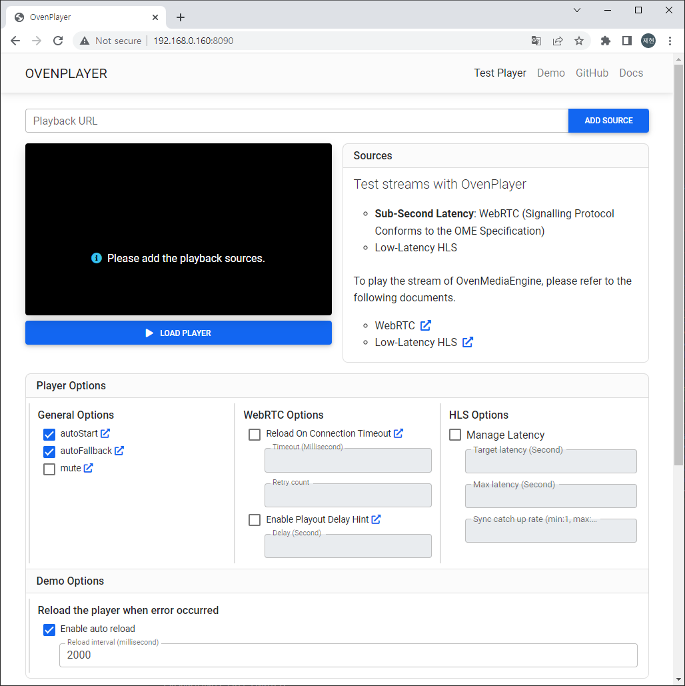
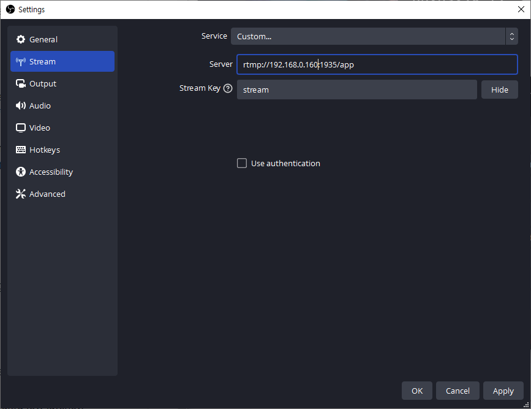
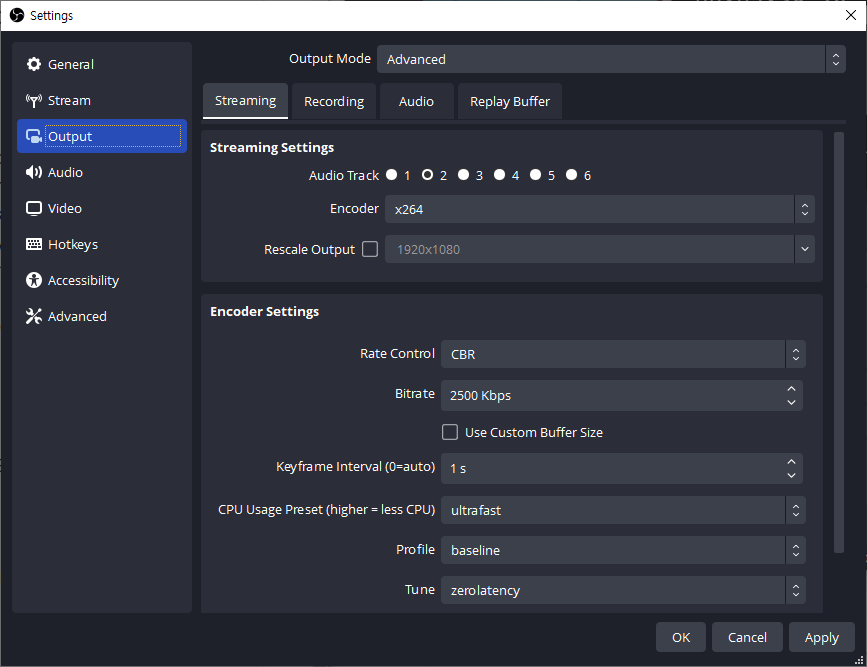
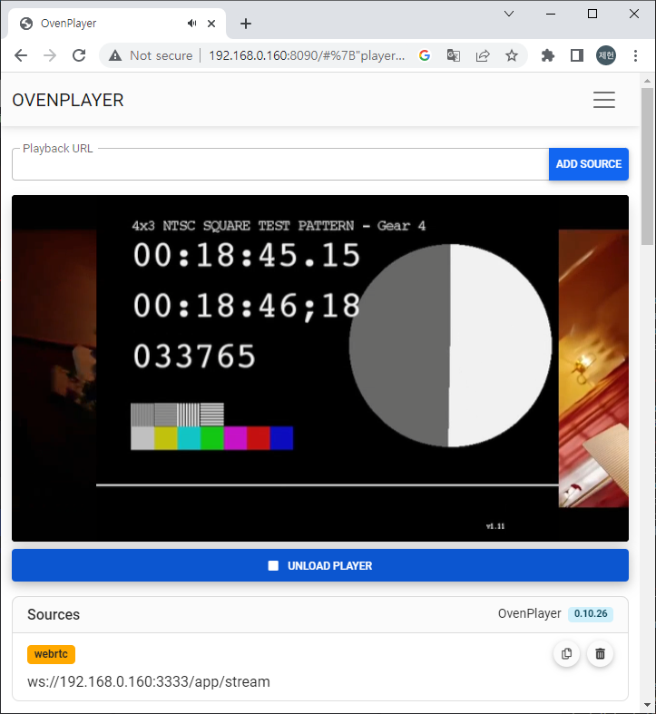
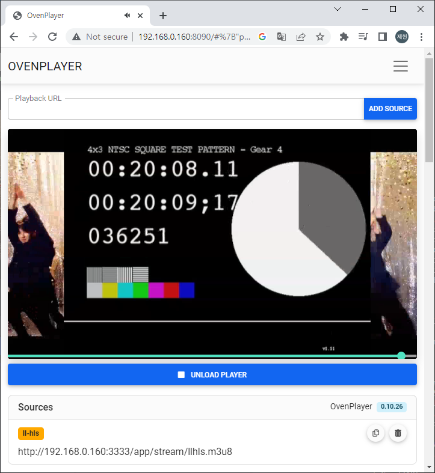

This page provides the fastest way to check playback of WebRTC and LLHLS using OvenMediaEngine. For installation and detailed settings, please refer to other pages.

## Run OvenMediaEngine

Run docker with the command below. `OME_HOST_IP` must be an IP address accessible by the player.

```sh
$ docker run --name ome -d -e OME_HOST_IP=Your.HOST.IP.Address \
-p 1935:1935 -p 9999:9999/udp -p 9000:9000 -p 3333:3333 -p 3478:3478 -p 10000:10000/udp -p 10000:10000/tcp \
ovenmedialabs/ovenmediaengine:latest
```

<details>

<summary>Check Status</summary>

You can check the docker container status with the following command:

```bash
$ docker ps -f name=ome
 CONTAINER ID   IMAGE                                 COMMAND                  CREATED              STATUS              PORTS                                                                                                                                                                                                                                                                                                                         NAMES
 c9dd9e56d7a0   ovenmedialabs/ovenmediaengine:latest  "/opt/ovenmediaengin…"   About a minute ago   Up About a minute   80/tcp, 3334/tcp, 4000-4005/udp, 10001-10010/udp, 0.0.0.0:1935->1935/tcp, :::1935->1935/tcp, 0.0.0.0:3333->3333/tcp, :::3333->3333/tcp, 0.0.0.0:3478->3478/tcp, :::3478->3478/tcp, 0.0.0.0:9000->9000/tcp, :::9000->9000/tcp, 0.0.0.0:9999->9999/udp, :::9999->9999/udp, 0.0.0.0:10000->10000/udp, :::10000->10000/udp, 0.0.0.0:10000->10000/tcp, :::10000->10000/tcp   ome
```

You can view the log with the command below. This is important because you can check the version of OvenMediaEngine that is running.

```
$ docker logs ome -f
[2023-03-06 08:01:24.810] I [OvenMediaEngine:1] Config | config_manager.cpp:239  | Trying to set logfile in directory... (/var/log/ovenmediaengine)
[2023-03-06 08:01:24.810] I [OvenMediaEngine:1] Config | config_manager.cpp:261  | Trying to load configurations... (origin_conf/Server.xml)
[2023-03-06 08:01:24.816] I [OvenMediaEngine:1] OvenMediaEngine | banner.cpp:23   | OvenMediaEngine v0.15.1 () is started on [ab3995acafd4] (Linux x86_64 - 5.13.0-44-generic, #49~20.04.1-Ubuntu SMP Wed May 18 18:44:28 UTC 2022)
...
```

</details>

## Run OvenPlayer Demo&#x20;

```bash
$ docker run -d --name ovenplayerdemo -p 8090:80 ovenmedialabs/ovenplayerdemo:latest
```

<details>

<summary>Check Status</summary>

You can access the OvenPlayerDemo docker container with a browser as shown below.

http://Your.Docker.Host.IP:8090/



</details>

## Publishing

Publish your live stream to OvenMediaEngine using a live encoder like [OBS](https://obsproject.com/).&#x20;

<details>

<summary>Ingest URLs</summary>

**RTMP** - rtmp://Your.Docker.Host.IP:1935/app/stream

**SRT** - srt://Your.Docker.Host.IP:9999?streamid=default/app/stream

**WHIP** - http://Your.Docker.Host.IP:3333/app/stream?direction=whip

</details>

The RTMP publishing address is :&#x20;

**Server** `rtmp://{Your Docker Host}:1935/app`

**Stream Key** `stream`



The settings below are recommended for ultra-low latency.&#x20;

| Setting           | Value                                                                                                                                                       |
| ----------------- | ----------------------------------------------------------------------------------------------------------------------------------------------------------- |
| Keyframe Interval | 1s (DO NOT set it to **0**) |
| CPU Usage Preset  | ultrafast                                                                                                                                                   |
| Profile           | baseline                                                                                                                                                    |
| Tune              | zerolatency                                                                                                                                                 |



## Playback

Open the installed OvenPlayer Demo page in your browser.&#x20;

`http://{Your Docker Host}:8090/`


#### WebRTC Playback

Add `ws://{Your Docker Host}:3333/app/stream` to the Playback URL and click the ADD SOURCE and LOAD PLAYER button to play the live stream with WebRTC.



#### LLHLS Playback

Add `http://{Your Docker Host}:3333/app/stream/llhls.m3u8` to the Playback URL and click the ADD SOURCE and LOAD PLAYER button to play the live stream with LLHLS.



