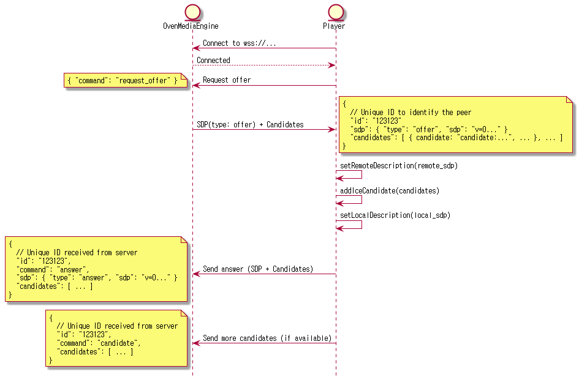
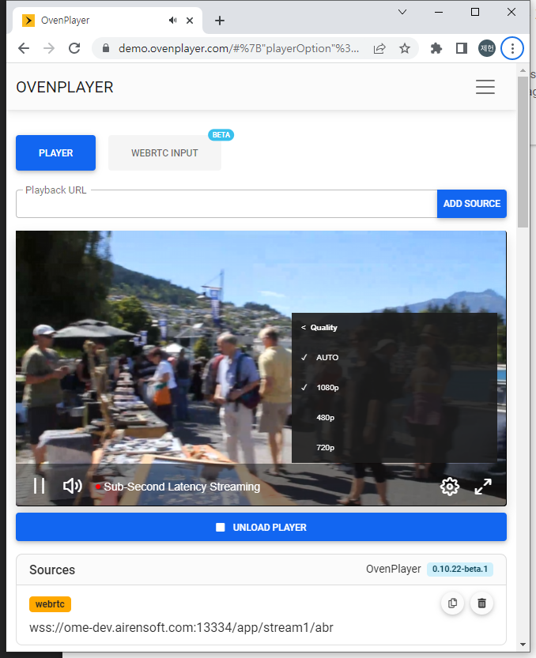

OvenMediaEngine supports WebRTC streaming with sub-second latency.

| | |
|---|---|
| **Container** | RTP / RTCP |
| **Security** | DTLS, SRTP |
| **Transport** | ICE |
| **Error Correction** | ULPFEC (VP8, H.264), In-band FEC (Opus) |
| **Codec** | VP8, H.264, H.265, Opus |
| **Signaling** | Self-Defined Signaling Protocol, Embedded WebSocket-based Server |
| **Default URL Pattern** | `ws[s]://{Host}[:{Port}]/{App}/{Stream}` |

## Configuration

Add `<WebRTC>` under `<Bind><Publishers>` in `Server.xml`:

```xml
<!-- /Server/Bind -->
<Publishers>
    ...
    <WebRTC>
        <Signalling>
            <Port>3333</Port>
            <TLSPort>3334</TLSPort>
            <WorkerCount>1</WorkerCount>
        </Signalling>
        <IceCandidates>
            <!-- Use a specific IP or ${PublicIP}, NOT *.                              -->
            <!-- * advertises every network interface (docker, VPN, etc.) as a         -->
            <!-- candidate, which slows down ICE negotiation on the browser side.      -->
            <!-- ${PublicIP} is auto-resolved via <StunServer> at startup.             -->
            <!-- Use a single port and raise IceWorkerCount for throughput scaling     -->
            <!-- instead of adding more ports.                                         -->
            <IceCandidate>${PublicIP}:10000/udp</IceCandidate>
            <IceCandidate>${PublicIP}:10000/tcp</IceCandidate>   <!-- Direct TCP ICE (RFC 6544) -->
            <TcpRelay>${PublicIP}:3478</TcpRelay>               <!-- TURN relay (WebRTC/TCP via TURN) -->
            <TcpRelayForce>false</TcpRelayForce>
            <IceWorkerCount>4</IceWorkerCount>           <!-- Increase for high viewer count -->
            <TcpIceWorkerCount>1</TcpIceWorkerCount>     <!-- Worker threads for Direct TCP ICE -->
            <TcpRelayWorkerCount>1</TcpRelayWorkerCount> <!-- Worker threads for TURN relay -->
            <DefaultTransport>udptcp</DefaultTransport>  <!-- udptcp (default) | udp | tcp | relay | all -->
        </IceCandidates>
    </WebRTC>
    ...
</Publishers>
```

### ICE

WebRTC uses ICE for connections and specifically NAT traversal. The web browser or player exchanges the ICE candidates with each other in the signalling phase.

OvenMediaEngine supports three transport types for ICE candidates:

| Type | Configuration | Description |
|---|---|---|
| UDP host | `<IceCandidate>IP:port/udp</IceCandidate>` | Standard UDP, lowest latency, preferred by browsers |
| Direct TCP ICE | `<IceCandidate>IP:port/tcp</IceCandidate>` | TCP connection direct to OME (RFC 6544, passive mode), no TURN relay needed |
| TURN relay | `<TcpRelay>IP:port</TcpRelay>` | Browser connects to embedded TURN server over TCP, works through strict firewalls |

The IP address in `<IceCandidate>` determines which addresses are advertised to browsers as ICE candidates. You can use:

- A specific IP: `<IceCandidate>203.0.113.1:10000/udp</IceCandidate>`
- `${PublicIP}` to auto-detect the public IP via the configured `<StunServer>`: `<IceCandidate>${PublicIP}:10000/udp</IceCandidate>`


:::danger

**Do not use `*` for ICE candidate IP in production.**

When `*` is specified, OvenMediaEngine collects the IP address of every network interface on the host (including Docker bridge interfaces (`172.17.x.x`), VPN adapters, and other internal-only NICs) and advertises all of them as ICE candidates to the browser. The browser will attempt connectivity checks against every single candidate. This significantly increases ICE negotiation time and can cause connection delays or failures when the browser cannot reach those internal addresses.

:::


When no `?transport` query parameter is specified, the behavior follows `<DefaultTransport>` (default: `udptcp`). By default, OME sends UDP and Direct TCP candidates. TURN relay info (`iceServers`) is only included when `?transport=relay` or `?transport=all` is used, or when `<TcpRelayForce>` is `true`.

Each transport type has a dedicated worker-thread pool. You can tune the thread count independently:

| Configuration | Default | Applies to |
|---|---|---|
| `<IceWorkerCount>` | 1 | UDP ICE socket threads |
| `<TcpIceWorkerCount>` | 1 | Direct TCP ICE socket threads (RFC 6544) |
| `<TcpRelayWorkerCount>` | 1 | TURN relay socket threads |

For most deployments the default of `1` is fine. Increase `<IceWorkerCount>` / `<TcpIceWorkerCount>` when serving many simultaneous viewers on a multi-core server.

> **Note:** `<IceWorkerCount>` and `<TcpIceWorkerCount>` are independent. Each defaults to `1` when not set. Setting `<IceWorkerCount>` does **not** affect Direct TCP ICE sockets; set `<TcpIceWorkerCount>` separately to tune the Direct TCP ICE thread count.
>
> The worker count applies **per port**. For example, `IceWorkerCount=4` with a single UDP port creates **4** UDP ICE threads.
>
> **Prefer a single port with a higher `<IceWorkerCount>` over multiple ports.** Adding more ports multiplies the thread count (`N ports x IceWorkerCount`) and, more importantly, multiplies the number of ICE candidates advertised to clients, which slows down ICE negotiation. For throughput scaling, increase `<IceWorkerCount>` on a single port instead.

#### Default Transport

`<DefaultTransport>` controls which candidate types are included in the signaling response when the player does not specify a `?transport` query parameter. Valid values: `udp`, `tcp`, `relay`, `udptcp` (default), `all`. See [?transport query parameter](webrtc-publishing.md#transport-query-parameter) for the full mapping.

### Signalling

OvenMediaEngine includes an embedded WebSocket-based signaling server. OvenPlayer supports this signaling protocol out of the box. To use a custom player, implement the signaling protocol described below.

To change the signaling port, update `<Bind><Publishers><WebRTC><Signalling><Port>` in `Server.xml`.

#### Signalling Protocol

The Signalling protocol is defined in a simple way:



To use a player other than OvenPlayer, implement the signaling protocol shown above.

## Streaming

### Publisher

Configure `<WebRTC>` under `<Publishers>` in the Application settings:

```xml
<!-- /Server/VirtualHosts/VirtualHost/Applications/Application -->
<Publishers>
    ...
    <WebRTC>
        <Timeout>30000</Timeout>
        <BandwidthEstimation>TransportCC</BandwidthEstimation> <!-- REMB | ALL -->
        <Rtx>false</Rtx>
        <Ulpfec>false</Ulpfec>
        <JitterBuffer>true</JitterBuffer>
        <PlayoutDelay>
            <Min>0</Min>
            <Max>0</Max>
        </PlayoutDelay>
    </WebRTC>
    ...
</Publishers>
```

<table><thead><tr><th width="189">Option</th><th width="433.33333333333326">Description</th><th>Default</th></tr></thead><tbody><tr><td>`Timeout`</td><td>ICE (STUN request/response) timeout as milliseconds, if there is no request or response during this time, the session is terminated.</td><td>`30000`</td></tr><tr><td>`Rtx`</td><td>WebRTC retransmission, a useful option in WebRTC/udp, but ineffective in WebRTC/tcp.</td><td>`false`</td></tr><tr><td>`Ulpfec`</td><td>WebRTC forward error correction, a useful option in WebRTC/udp, but ineffective in WebRTC/tcp.</td><td>`false`</td></tr><tr><td>`JitterBuffer`</td><td>Smooths bursty frame delivery by spacing media frames according to their PTS. See below for details.</td><td>`false`</td></tr><tr><td>`PlayoutDelay`</td><td>Hints the minimum and maximum playout delay (in milliseconds, from 0 to 40950) to the player so it keeps a deeper jitter buffer for video. Useful when the network introduces bursty latency and the default low-latency buffer causes hitches. See below for details.</td><td>`Disabled`</td></tr><tr><td>`BandwidthEstimation`</td><td><p>Determines which method OvenMediaEngine uses to estimate the bandwidth of the connected player. This bandwidth estimation is required for WebRTC ABR when OME selects and sends an appropriate rendition to the player.</p><p>If <strong>TransportCC</strong> or <strong>REMB</strong> is set, only one method is used. If the default value <strong>All</strong> is set, both methods are included in the SDP offer, and the player operates according to its preference. Most modern browsers use Transport-cc by default in this case. Transport-cc provides more accurate bandwidth estimation.</p></td><td>`All`</td></tr></tbody></table>

#### JitterBuffer

Without the jitter buffer, frames are forwarded to the player as soon as they arrive from the Provider. Any timing jitter introduced upstream (network jitter, encoder bursts, ingest pacing, and so on) is passed straight through to the player, which can result in uneven playback.

When the jitter buffer is enabled, OvenMediaEngine evens out the spacing between frames before sending. The player receives a steady stream and playback runs at a consistent speed. In a healthy environment where upstream jitter is already low, the added latency is negligible.

#### PlayoutDelay

`<PlayoutDelay>` asks the player to hold incoming video for at least `<Min>` and at most `<Max>` milliseconds before rendering. A larger minimum gives the player a deeper buffer to absorb network jitter, at the cost of higher end-to-end latency. Both values must be between `0` and `40950`. Omit the `<PlayoutDelay>` element to leave playout timing entirely up to the player.

The hint applies to video only. With a non-trivial `<Min>`, audio may briefly play ahead of video for a few seconds at session start, until the player aligns the two streams. If this initial offset is undesirable, lower `<Min>` or omit `<PlayoutDelay>`.

### Encoding

A WebRTC stream starts when a live source is received and a stream is created. Viewers can play using OvenPlayer or any player that implements the OvenMediaEngine signaling protocol.

WebRTC does not support AAC. When ingesting RTMP with AAC audio, the audio track must be transcoded to Opus.

**H.264 + Opus is the recommended codec combination.** It works across all major browsers including Safari on iOS, which does not support VP8. If you also want to serve VP8 (for example, to reduce CPU usage on devices with hardware H.264 decoding issues), add a VP8 encode track in addition to H.264.

```xml
<!-- /Server/VirtualHosts/VirtualHost/Applications/Application/OutputProfiles -->
<OutputProfile>
    <Name>bypass_stream</Name>
    <OutputStreamName>${OriginStreamName}</OutputStreamName>
    <Encodes>
        <Video>
            <Bypass>true</Bypass>
        </Video>
        <Audio>
            <Codec>opus</Codec>
            <Bitrate>128000</Bitrate>
            <Samplerate>48000</Samplerate>
            <Channel>2</Channel>
        </Audio>
    </Encodes>
</OutputProfile>
```

### Playback

Once a stream is active, play it via OvenPlayer using the following URLs:

| Protocol                 | URL format                                                                                  |
| ------------------------ | ------------------------------------------------------------------------------------------- |
| WebRTC Signalling        | `ws://{OvenMediaEngine Host}[:{Signaling Port}/{App Name}/{Stream Name}[/{Playlist Name}]`  |
| Secure WebRTC Signalling | `wss://{OvenMediaEngine Host}[:{Signaling Port}/{App Name}/{Stream Name}[/{Playlist Name}]` |

If you use the default configuration, you can stream to the following URL:

* `ws://{OvenMediaEngine Host}:3333/app/stream`
* `wss://{OvenMediaEngine Host}:3333/app/stream`

We have prepared a test player to make it easy to check if OvenMediaEngine is working. Please see the [Test Player](../quick-start/test-player.md) chapter for more information.

## Adaptive Bitrates Streaming (ABR)

OvenMediaEngine provides adaptive bitrate streaming over WebRTC. OvenPlayer can also play and display OvenMediaEngine's WebRTC ABR URL.



### Create Playlist for WebRTC ABR

You can provide ABR by creating a `playlist` in `<OutputProfile>` as shown below. The URL to play the playlist is `ws[s]://{OvenMediaEngine Host}[:{Signaling Port}]/{App Name}/{Stream Name}/master`.

`<Playlist>/<Rendition>/<Video>` and `<Playlist>/<Rendition>/<Audio>` are linked to encode tracks by `<Encodes>/<Video>/<Name>` or `<Encodes>/<Audio>/<Name>`.


:::warning

It is not recommended to use a \<Bypass>true\</Bypass> encode item if you want a seamless transition between renditions because there is a time difference between the transcoded track and bypassed track.

:::


If `<Options>/<WebRtcAutoAbr>` is set to true, OvenMediaEngine will measure the bandwidth of the player session and automatically switch to the appropriate rendition.

Here is an example play URL for ABR in the playlist settings below. `wss://domain:13334/app/stream/master`


:::info

Streaming starts from the top rendition of Playlist, and when Auto ABR is true, the server finds the best rendition and switches to it. Alternatively, the user can switch manually by selecting a rendition in the player.

:::


```xml
<OutputProfiles>
<OutputProfile>
    <Name>default</Name>
    <OutputStreamName>${OriginStreamName}</OutputStreamName>

    <Playlist>
        <Name>for Webrtc</Name>
        <FileName>master</FileName>
        <Options>
            <WebRtcAutoAbr>false</WebRtcAutoAbr> 
        </Options>
        <Rendition>
            <Name>1080p</Name>
            <Video>1080p</Video>
            <Audio>opus</Audio>
        </Rendition>
        <Rendition>
            <Name>480p</Name>
            <Video>480p</Video>
            <Audio>opus</Audio>
        </Rendition>
        <Rendition>
            <Name>720p</Name>
            <Video>720p</Video>
            <Audio>opus</Audio>
        </Rendition>
    </Playlist>

    <Playlist>
        <Name>for llhls</Name>
        <FileName>master</FileName>
        <Rendition>
            <Name>480p</Name>
            <Video>480p</Video>
            <Audio>bypass_audio</Audio>
        </Rendition>
        <Rendition>
            <Name>720p</Name>
            <Video>720p</Video>
            <Audio>bypass_audio</Audio>
        </Rendition>
    </Playlist>
    
    <Encodes>
        <Video>
            <Name>bypass_video</Name>
            <Bypass>true</Bypass>
        </Video>
        <Video>
            <Name>480p</Name>
            <Codec>h264</Codec>
            <Width>640</Width>
            <Height>480</Height>
            <Bitrate>500000</Bitrate>
            <Framerate>30</Framerate>
        </Video>
        <Video>
            <Name>720p</Name>
            <Codec>h264</Codec>
            <Width>1280</Width>
            <Height>720</Height>
            <Bitrate>2000000</Bitrate>
            <Framerate>30</Framerate>
        </Video>
        <Video>
            <Name>1080p</Name>
            <Codec>h264</Codec>
            <Width>1920</Width>
            <Height>1080</Height>
            <Bitrate>5000000</Bitrate>
            <Framerate>30</Framerate>
        </Video>
        <Audio>
            <Name>bypass_audio</Name>
            <Bypass>True</Bypass>
        </Audio>
        <Audio>
            <Name>opus</Name>
            <Codec>opus</Codec>
            <Bitrate>128000</Bitrate>
            <Samplerate>48000</Samplerate>
            <Channel>2</Channel>
        </Audio>
    </Encodes>
</OutputProfile>
</OutputProfiles>
```

See the [Adaptive Bitrates Streaming](../transcoding/abr.md#adaptive-bitrate-streaming-abr) section for more details on how to configure renditions.

### Multiple codec support in Playlist

WebRTC can negotiate codecs with SDP to support more devices. Playlist can set rendition with different kinds of codec. And OvenMediaEngine includes only renditions corresponding to the negotiated codec in the playlist and provides it to the player.


:::warning

If an unsupported codec is included in the Rendition, the Rendition is not used. For example, if the Rendition's Audio contains aac, WebRTC ignores the Rendition.

:::


In the example below, it consists of renditions with H.264 and Opus codecs set and renditions with VP8 and Opus codecs set. If the player selects VP8 in the answer SDP, OvenMediaEngine creates a playlist with only renditions containing VP8 and Opus and passes it to the player.

```xml
<Playlist>
    <Name>for Webrtc</Name>
    <FileName>abr</FileName>
    <Options>
        <WebRtcAutoAbr>false</WebRtcAutoAbr> 
    </Options>
    <Rendition>
        <Name>1080p</Name>
        <Video>1080p</Video>
        <Audio>opus</Audio>
    </Rendition>
    <Rendition>
        <Name>480p</Name>
        <Video>480p</Video>
        <Audio>opus</Audio>
    </Rendition>
    <Rendition>
        <Name>720p</Name>
        <Video>720p</Video>
        <Audio>opus</Audio>
    </Rendition>
    
    <Rendition>
        <Name>1080pVp8</Name>
        <Video>1080pVp8</Video>
        <Audio>opus</Audio>
    </Rendition>
    <Rendition>
        <Name>480pVp8</Name>
        <Video>480pVp8</Video>
        <Audio>opus</Audio>
    </Rendition>
    <Rendition>
        <Name>720pVp8</Name>
        <Video>720pVp8</Video>
        <Audio>opus</Audio>
    </Rendition>
</Playlist>
```

## WebRTC over TCP

There are environments where the network speed is fast but UDP packet loss is abnormally high. In such an environment, WebRTC may not play normally. OvenMediaEngine supports two independent mechanisms for WebRTC over TCP:

| Mode | How it works | Configuration |
|---|---|---|
| **Direct TCP ICE** (RFC 6544) | Browser connects directly to OME over TCP, no relay, lower overhead | `<IceCandidate>IP:port/tcp</IceCandidate>` |
| **TURN relay** (RFC 8656) | Browser connects to OME's embedded TURN server over TCP. Useful for browsers or players that do not support Direct TCP ICE (RFC 6544) | `<TcpRelay>IP:port</TcpRelay>` |

Both modes can be enabled simultaneously. When `?transport` is omitted, the behavior follows `<DefaultTransport>` (default: `udptcp`). By default, OME sends UDP and Direct TCP candidates only. TURN relay info (`iceServers`) is not included unless `?transport=relay` or `?transport=all` is used, or `<TcpRelayForce>` is set to `true`.

### Turn on TURN relay server

You can enable the embedded TURN server by setting `<TcpRelay>` in the WebRTC Bind.

> Example : `<TcpRelay>*:3478</TcpRelay>`

OME may sometimes not be able to get the server's public IP on its local interface (e.g. Docker or AWS). Specify the public IP for `Relay IP`. If `*` is used, the public IP obtained from [`<StunServer>`](../configuration/README.md#stunserver) and all IPs from local interfaces are used. `<Port>` is the TCP port on which the TURN server listens.

```xml
<Server version="8">
    ...
    <StunServer>stun.l.google.com:19302</StunServer>
    <Bind>
        <Publishers>
            <WebRTC>
                ...
            <IceCandidates>
                <!-- ${PublicIP} is resolved via <StunServer>. Falls back to all local IPs if STUN fails. -->
                <IceCandidate>${PublicIP}:10000/udp</IceCandidate>
                <!-- Direct TCP ICE (RFC 6544) -->
                <IceCandidate>${PublicIP}:10000/tcp</IceCandidate>
                <!-- TURN relay for clients that do not support Direct TCP ICE -->
                <TcpRelay>${PublicIP}:3478</TcpRelay>
                <TcpRelayForce>false</TcpRelayForce>
                <IceWorkerCount>1</IceWorkerCount>
                <TcpIceWorkerCount>1</TcpIceWorkerCount>
                <TcpRelayWorkerCount>1</TcpRelayWorkerCount>
            </IceCandidates>
            </WebRTC>
        </Publishers>
    </Bind>
    ...
</Server>
```


:::info

If `*` is used as the IP of `<TcpRelay>` and `<IceCandidate>`, all available candidates are generated and sent to the player, so the player tries to connect to all candidates until a connection is established. This can cause delay in initial playback. Therefore, specifying the `${PublicIP}` macro or IP directly may be more beneficial to quality.

:::


:::info

`<TcpForce>` has been renamed to `<TcpRelayForce>`. The old name is still accepted for backward compatibility. When set to `true`, TURN relay info is always sent to the player even without `?transport=relay`.

:::


### `?transport` query parameter

The `?transport` query parameter controls which ICE candidates and TURN relay info (`iceServers`) are sent to the player. The browser/player uses `iceServers` to set up TURN relay; if `iceServers` is not sent, the browser cannot use TURN relay.

| Value | Direct ICE candidates sent | TURN relay info (`iceServers`) sent | Player behavior |
|---|---|---|---|
| (none) / `udptcp` | All configured (UDP + TCP) | No | UDP → Direct TCP (no relay) |
| `udp` | UDP only | No | UDP only |
| `tcp` | Direct TCP ICE only (RFC 6544) | No | Direct TCP only |
| `relay` | None | Yes | TURN relay only |
| `all` | All configured (UDP + TCP) | Yes | UDP → Direct TCP → TURN relay fallback |

When `?transport` is omitted, the behavior follows `<DefaultTransport>` (default: `udptcp`).


:::warning

**Behavior change from previous versions**

In previous versions, `?transport=tcp` sent TURN relay info (`iceServers`) to the player and routed WebRTC/TCP traffic through the embedded TURN server. This behavior has changed:

- `?transport=tcp` now means **Direct TCP ICE** (RFC 6544), a direct TCP connection to OvenMediaEngine without any relay.
- To use TURN relay over TCP (the previous `tcp` behavior), use **`?transport=relay`** instead.

:::


:::info

**Why is `iceServers` not sent by default?**

When the browser receives `iceServers` (TURN server information), it is configured as `iceTransportPolicy: "relay"` internally if no direct candidates are provided, or it will try relay alongside direct candidates if direct candidates are also present. However, some players or environments may have `iceTransportPolicy` pre-set to `"relay"`, which means the browser will **only** use TURN relay even if direct UDP/TCP candidates were provided. To enable the full fallback chain (UDP → Direct TCP → TURN relay), use `?transport=all`, which sends both direct candidates and `iceServers`.

:::


:::info

**Direct TCP ICE vs. TURN relay**

`?transport=tcp` now sends **Direct TCP ICE candidates only** (RFC 6544), not TURN relay. Direct TCP ICE connects the browser directly to OvenMediaEngine over TCP without any relay server. Most modern browsers support RFC 6544 Direct TCP ICE. To force TURN relay over TCP, use `?transport=relay`.

:::


### `<DefaultTransport>` configuration

The `<DefaultTransport>` element sets the transport policy applied when no `?transport` query parameter is present in the URL. Valid values are `udptcp` (default), `udp`, `tcp`, `relay`, and `all`.

```xml
<IceCandidates>
    <IceCandidate>${PublicIP}:10000/udp</IceCandidate>
    <IceCandidate>${PublicIP}:10000/tcp</IceCandidate>
    <TcpRelay>${PublicIP}:3478</TcpRelay>
    <DefaultTransport>udptcp</DefaultTransport>  <!-- udptcp (default) | udp | tcp | relay | all -->
</IceCandidates>
```

| Value | Equivalent to |
|---|---|
| `udptcp` (default) | No `?transport` with `udptcp`: UDP + TCP direct, no relay info |
| `udp` | `?transport=udp` |
| `tcp` | `?transport=tcp` |
| `relay` | `?transport=relay`: relay only |
| `all` | `?transport=all`: UDP + TCP + relay fallback |

### WebRTC over TCP with OvenPlayer

You can restrict playback to Direct TCP ICE by attaching `?transport=tcp` to the play URL:

```
ws[s]://{OvenMediaEngine Host}[:{Signaling Port}]/{App Name}/{Stream Name}?transport=tcp
```

To use TURN relay (useful for environments where direct connections are blocked):

```
ws[s]://{OvenMediaEngine Host}[:{Signaling Port}]/{App Name}/{Stream Name}?transport=relay
```

To enable full fallback (UDP → Direct TCP → TURN relay):

```
ws[s]://{OvenMediaEngine Host}[:{Signaling Port}]/{App Name}/{Stream Name}?transport=all
```

OvenPlayer automatically sets `iceServers` using the TURN server information received via signaling.

### Custom player

If you are using a custom player, set `iceServers` from the signaling response in `RTCPeerConnection`. When using TURN relay (`?transport=relay`), also set `iceTransportPolicy` to `"relay"` to force all traffic through the TURN server. When using `?transport=all` (UDP/TCP direct + TURN relay fallback), omit `iceTransportPolicy` or set it to `"all"` so the browser can use direct candidates first:

```javascript
// ?transport=relay — TURN relay only
myPeerConnection = new RTCPeerConnection({
  iceServers: [
    {
      urls: "turn:Relay IP:Port?transport=tcp",
      username: "ome",
      credential: "airen"
    }
  ],
  iceTransportPolicy: "relay"
});

// ?transport=all — UDP/TCP direct first, TURN relay fallback
myPeerConnection = new RTCPeerConnection({
  iceServers: [
    {
      urls: "turn:Relay IP:Port?transport=tcp",
      username: "ome",
      credential: "airen"
    }
  ],
  iceTransportPolicy: "all"  // default, can be omitted
});
```

When sending `Request Offer` in the [signaling](webrtc-publishing.md#signalling-protocol) phase, if `<TcpRelay>` is configured, OvenMediaEngine includes `ice_servers` in the offer response by default. You can use this information to set `iceServers` in your `RTCPeerConnection`.

```json
{
  "command": "offer",
  "id": 506764844,
  "peer_id": 0,
  "sdp": { "..." },
  "candidates": [
    {"candidate": "candidate:0 1 UDP 2130706431 192.168.0.200 10000 typ host", "sdpMLineIndex": 0},
    {"candidate": "candidate:1 1 TCP 1275068415 192.168.0.200 10000 typ host tcptype passive", "sdpMLineIndex": 0}
  ],
  "ice_servers": [{"credential": "airen", "urls": ["turn:192.168.0.200:3478?transport=tcp"], "user_name": "ome"}],
  "iceServers":  [{"credential": "airen", "urls": ["turn:192.168.0.200:3478?transport=tcp"], "username": "ome"}],
  "code": 200
}
```
