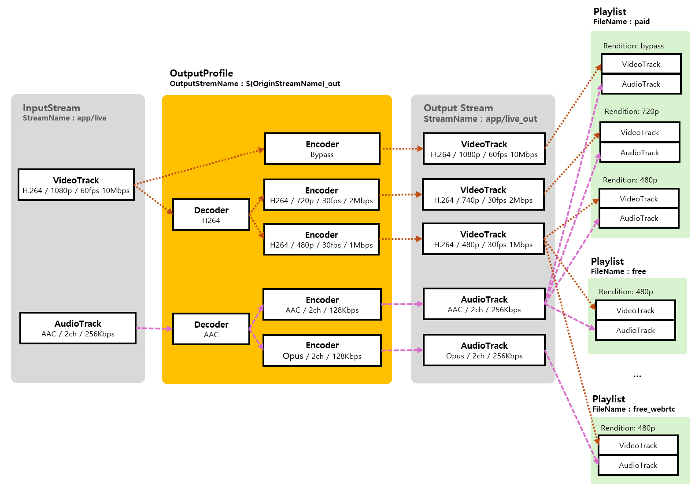

import Tabs from '@theme/Tabs';
import TabItem from '@theme/TabItem';

OvenMediaEngine supports Live Transcoding for Adaptive Bitrate(ABR) streaming and protocol compatibility.  Each protocol supports different codecs, and ABR needs to change resolution and bitrate in different ways.  Using **OutputProfile**, codecs, resolutions, and bitrates can be converted, and ABR can be configured as a variety of sets using a **Playlist**.

This document explains how to configure encoding settings, set up playlists.

Transcoding and Adaptive Streaming Architecture

### Transcoding

This section explains how to define output streams, change the codec, bitrate, resolution, frame rate, sample rate, and channels for video/audio, as well as how to use the bypass method.

[OutputProfile](output-profile.md)

### Adaptive Bitrate (ABR) Stream

This section explains how to use a Playlist to assemble ABR streams by selecting tracks encoded in various qualities.

[abr.md](abr.md)

### TranscodeWebhook

The transcoding webhook feature is used when dynamic changes to encoding and ABR configuration are needed based on the type or quality of the input stream.

[transcodewebhook.md](transcodewebhook.md)

### Support Codecs

These are the types of supported decoding and encoding codecs.

<Tabs>
<TabItem value="decoding-codecs" label="Decoding Codecs">

**Video**&#x20;

* VP8, H.264, H.265

**Audio**&#x20;

* AAC, Opus, MP3, MP2

</TabItem>
<TabItem value="encoding-codecs" label="Encoding Codecs">

**Video**

* VP8, H.264, H.265

**Audio**

* AAC, Opus

**Image**&#x20;

* &#x20;Jpeg, Png, WebP

</TabItem>
</Tabs>

### **Hardware accelerators**

These are the types of hardware accelerators officially supported.

* NVIDIA GPU
* Xilinx Alveo U30 MA enterpise only
* NETINT VPU enterpise only (experiment)

